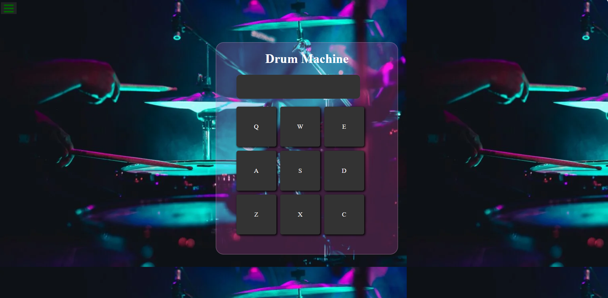

# Build-a-Drum-Machine
# Description:
This pull request adds the implementation of a React-based Drum Machine, fulfilling the requirements as outlined in the user stories. The app features clickable drum pads, responsive keyboard interaction, and display of the corresponding sound ID. Additionally, the styling conforms to user-defined design specifications.

**Features**

 . Created a DrumPad component for each drum pad that plays a sound when clicked or when the corresponding key is pressed.
 . Each pad contains a label for its sound and is tied to an audio file.
 . Built the DrumMachine container that manages the drum pad layout and handles sound play and display functionality.
 . Utilized React’s useState to store the currently played sound and display it in the interface.
 . Handled event listeners for both clicks and keypresses.

# Demo
# live demo [()]


**User Stories Fulfilled:**

User Story 1: Each drum pad element plays a specific audio clip when clicked or corresponding key is pressed.
User Story 2: Audio clips are assigned unique IDs to display in the result screen when triggered.
User Story 3: The drum machine works with keyboard inputs, linking each pad to a key.
User Story 4: Display the currently playing sound on the screen when triggered.

## Technologies Used 💡

- React
- CSS

## Installation 🔧

1. Clone the repository:
```bash
   git clone git@github.com:MasomaRezaie/build-drum-machine.git
   cd build-drum-machine
```
2. Install dependencies:
```bash
npm install
```

3. Start the development server:
```bash 
npm start
```

# Usage 🔊
Open your browser to http://localhost:3000 to view the app. You can click the on buttons  button to hear new  different sound.

# Acknowledgments
- freeCodeCamp for the project idea


## MasomRezaie👩‍💻

- LinkedIn: [(https://www.linkedin.com/in/MaomaRezaie/)]
- Email:  [(fmasom.rezaie135@gmail.com)]


# Contributing 🙏
 Please review the code and let me know if any further adjustments are needed!.